# Guide d'utilisation de Docker

## Introduction

Docker est une plateforme open-source qui permet de **conteneuriser** les applications. Un conteneur est un package léger et autonome qui regroupe une application avec toutes ses dépendances (bibliothèques, outils système, etc.) dans un environnement isolé et reproductible. Dans le cadre de ce guide, nous allons utiliser Docker pour améliorer de nombreux aspects de notre application **LanStation** (POK1), qui permettait de se connecter à l'aide d'identifiants stockés dans une base de données (PostgreSQL), et de transmettre des fichiers grâce à un socket (Socket.io). Après ceci, j'avais ajouté une fonctionnalité de LLM **local** : je fais tourner un modèle léger et open-source grâce à Ollama (ex: Mistal:7B) en tant que service. Le site permet aux autres utilisateurs du réseau d'utiliser ce chat pour des tâches simples, avec ou sans contexte internet.

Le problème est apparu dès le dépôt sur GitHub : les instructions d'installations sont **très** lourdes dès lors que l'on change de machine. Installation + setup de PSQL, pareil pour Ollama, etc. sans compter les problèmes potentiels de compatibilité si le système d'exploitation a changé. L'alternative avant Docker, c'est la machine virtuelle, c'est-à-dire l'émulation de hardware. Problème encore : une VM, c'est très lourd en ressources. Il faut essentiellement diviser par deux la performance du système.


### Pourquoi Docker ?

Les conteneurs Docker résolvent plusieurs problèmes :
- **Cohérence** : L'application fonctionne de la même manière sur tous les environnements (développement, test, production)
- **Isolation** : Chaque conteneur est isolé des autres et du système hôte
- **Légèreté** : Les conteneurs consomment moins de ressources que les machines virtuelles
- **Pas d'installation locale** : PostgreSQL, Ollama, Node.js s'exécutent dans les conteneurs. Pas besoin de les installer sur votre PC.
- **Portabilité** : Facile de déployer et de partager des conteneurs sur n'importe quel système

## Sommaire :

1. Préparation de l’environnement de travail
2. Généralités
3. Création des images et des conteneurs
4. Lancement des services de l’application


# 1. Préparation de l'environnement de travail

Avant de lancer les conteneurs, il faut préparer le projet et vérifier que l’environnement de travail est prêt.

## Prérequis

Pour suivre ce guide, il faut disposer de :
- **Docker** pour créer et exécuter les conteneurs
- **Docker Compose** pour orchestrer plusieurs services en même temps
- **Git** pour récupérer le projet
- Un système compatible Linux, Windows ou macOS

Pour Linux (Arch) :
```bash
sudo pacman -S docker docker-compose
```
Ou pour Docker Desktop (AUR):
```bash
yay -S docker-desktop
```
Pour Windows : https://docs.docker.com/engine/install/

## Basics

Pour commencer, faisons "Hello World" !

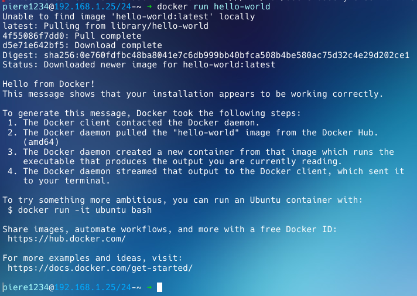

On remarquera que l'image n'est pas re-téléchargée si nous relançons `docker run hello-world`, puisque qu'il trouve cette fois-ci l'image localement. Pour la télécharger de nouveau ou la mettre à jour, on utilisera `docker pull hello-world`. Au passage, un `daemon` (ou "démon" en français) est un processus d'arrière-plan, ou un "service". Par défault, ce daemon s'exécute avec les privilèges administrateurs, car il a besoin notamment d'exposer des ports réseau.

## Réseau

Supposons que l'on veuille lancer un web server, comme **nginx**. Celui est disponible en remote par défault, il suffit de lancer `docker run nginx`.

**Question : où est-il ?**

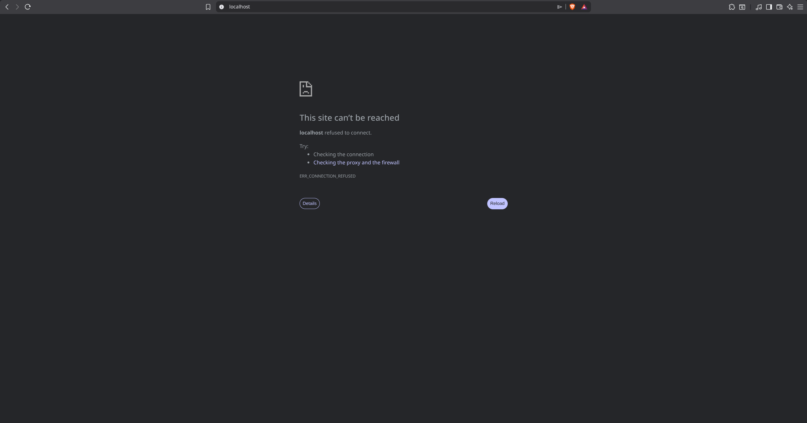

Nous n'avons pas assigné de ports réseau. IL faut faire deux choses :
 - Assigner un port Docker
 - Assigner un port local.

Par exemple, pour nginx, qui un est web server, nous pouvons donner 80 pour les deux.

Dans ce cas, on exécute : `docker run -d -p 80:80 nginx`. **-d** veut dire **détaché**, c'est-à-dire que notre terminal reste libre. **-p** spécifie le port : si j'écris **5000:80**, le service est accessible à **http://localhost:5000/** : le port local est 5000, le port Docker est 80.

Pour revenir à notre exemple de 80:80 :

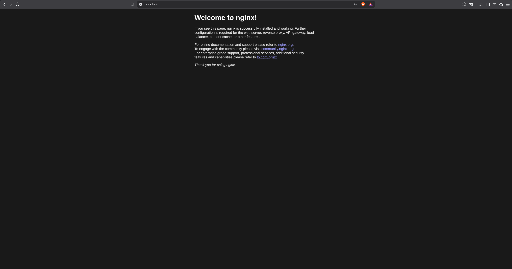

On appelle cette association de ports **Port Forwarding**.

Evidemment, le port 80 (port http par défaut) ne doit pas être associé localement à deux conteneurs en même temps. A l'inverse, pas de souci pour le port Docker.

Ceci pose problème :

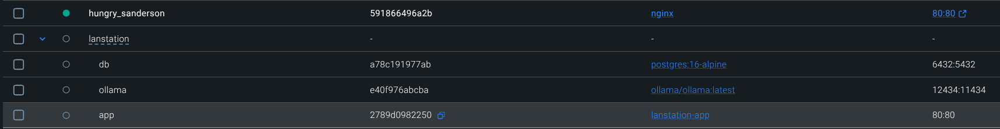

Ceci, pas du tout.

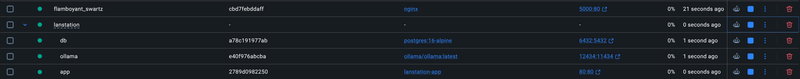

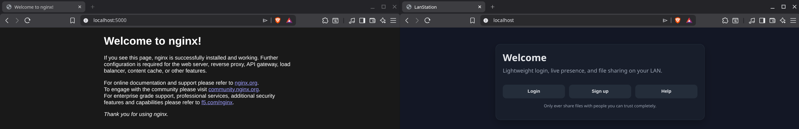

Nous parlerons plus de l'aspect réseau dans le [guide Docker sur la couche réseau](GUIDE_NETWORK.md)

## Préparer le projet

Le projet regroupe plusieurs parties qui doivent pouvoir communiquer entre elles :

- l’application web principale
- la base de données **PostgreSQL**
- le service **Ollama** pour le LLM local
- les échanges réseau liés aux fonctionnalités du site

L’objectif est de rendre tout cela reproductible sur n’importe quelle machine. Pour cela, on commence par récupérer le repo, puis on vérifie les fichiers de configuration nécessaires au lancement. Les paramètres sensibles ou variables d’environnement doivent être regroupés dans un fichier dédié, afin d’éviter de les écrire en dur dans le code, **.env**. On utilisera aussi **Docker Desktop** parce que c'est pratique.

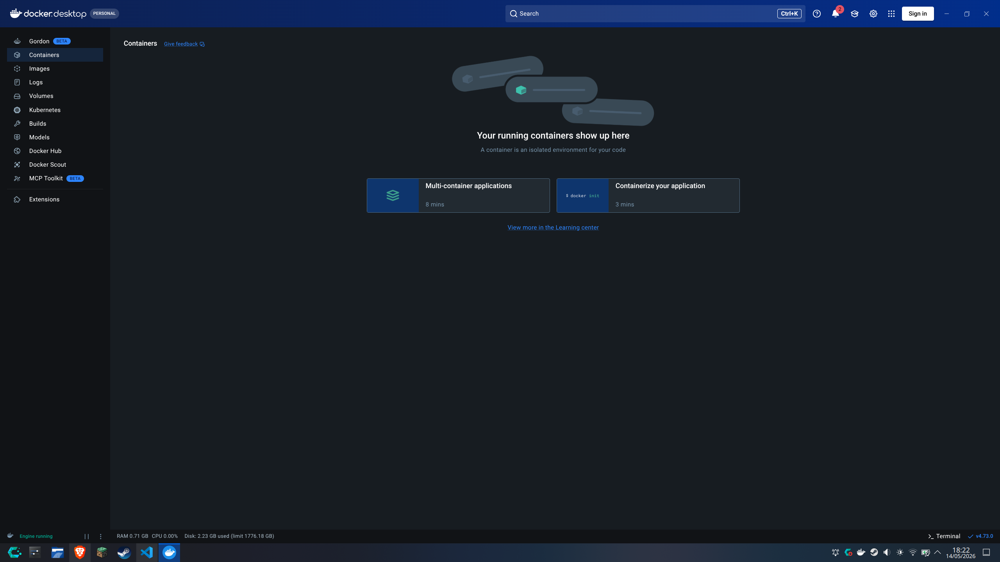

# 2. Généralités

Une fois l’environnement prêt, on peut commencer à construire les images Docker.

## Comprendre la logique

Il faut bien distinguer deux notions :
- **L’image** est le modèle de départ. Elle contient le système minimal, les dépendances, le code de l’application et les instructions nécessaires au lancement. Un **blueprint** en somme.
- **Le conteneur** est l’instance créée à partir de cette image.

Pour LanStation, on ne va pas créer une seule grosse image globale : on va séparer les responsabilités en plusieurs services :
- une image pour l’application web
- une image ou un service pour **PostgreSQL**
- un service pour **Ollama**


## Windows ou Linux ?

Pour faire simple, **Linux**. Parce que même sous Windows - c'est Linux. Windows utilise WSL 2 (pour Windows Subsystem for Linux), ce qui veut dire que Windows utilise lui-même une **VM** pour faire tourner Docker. Il y a donc inévitablement un peu d'**overhead** sous Windows, qui induit des problèmes de latence et de performance. Autant WSL 1 est un layer de compatibilité, assez léger, comme **Wine** qui permet d'exécuter des applications Windows sous Linux (ou MacOS), autant WSL 2 est une vraie VM.

# 3. Création des images et des conteneurs

## Commencer par le Dockerfile

Le point de départ est généralement un fichier **Dockerfile**. On y définit l’image de base à utiliser, le dossier de travail dans le conteneur, les fichiers à copier dans l’image, les dépendances à installer et la commande de démarrage de l’application. L’idée est de partir d’un environnement **propre**, puis d’y ajouter seulement ce qui est nécessaire au fonctionnement du projet.

```dockerfile
FROM node:22-alpine

WORKDIR /app

COPY package*.json ./

RUN npm install

COPY . .

EXPOSE 80

CMD ["node", "server.js"]
```

Ce fichier fait quatre choses importantes : il choisit une base Node légère, installe les dépendancies, copie le projet dans l’image et lance le serveur principal. Le port 80 est exposé parce que le serveur Express écoute déjà sur ce port dans [server.js](LanStation/server.js). A noter que sur Linux, le port 80 n'est généralement pas exposable sans **sudo** ; mais comme vu précédemment, le **daemon** Docker s'exécute avec les privilèges administrateurs, il n'aura pas de souci à ce niveau-là.

## Créer un conteneur

Une fois l’image prête, on peut créer un conteneur à partir de celle-ci. C’est lui qui permet d'exécuter l'application.

Lors du lancement, il faut souvent préciser :
- un nom pour identifier le conteneur
- un port à exposer vers l’extérieur
- des variables d’environnement
- éventuellement des volumes pour conserver certaines données

Le conteneur doit aussi pouvoir communiquer avec les autres services du projet. C’est pour cette raison qu’on prépare souvent plusieurs conteneurs en même temps.

On utilise donc un fichier docker-compose.yaml, qui définit essentiellement les "relations" qu'entretiennent les différents conteneurs, ainsi que le port forwarding.

```yaml
services:
	app:
		build: .
		container_name: lanstation-app
		env_file:
			- .env
		ports:
			- "80:80"
		depends_on:
			- db
			- ollama
		restart: unless-stopped
```

Ce bloc décrit le conteneur de l’application. `env_file` dit à Compose de lire les variables directement depuis `.env` sans les écrire dans le YAML. Le port hôte `80` est redirigé vers le port interne `80`. Ce fichier .env ressemble à [ceci](.env.example) et stocke les variables sensibles : cette référence à `.env` permet de ne rien stocker de sensible dans le Compose.

Attention ! `depends_on` n'attend pas que les services mentionnés soient lancés.

Si l'on utilise pas un compose, on lance un conteneur avec :

## Cas de LanStation

Pour LanStation, la création des conteneurs doit tenir compte de trois besoins principaux :
- l'application doit pouvoir parler à la base de données PostgreSQL
- le site doit pouvoir appeler le service Ollama
- les données persistantes ne doivent pas disparaître à chaque redémarrage

**Important** : PostgreSQL et Ollama sont des **services Docker**, pas des installations sur notre machine. Docker télécharge les images (`postgres:16-alpine` et `ollama/ollama:latest`) et les lance dans des conteneurs isolés.

On commence donc par définir les ports, les volumes et les variables d’environnement nécessaires à chaque service. Ensuite, on vérifie que les conteneurs démarrent dans le bon ordre et qu’ils sont bien capables de communiquer entre eux.

```yaml
	db:
		image: postgres:16-alpine
		container_name: lanstation-db
		env_file:
			- .env
		ports:
			- "5432:5432"
		volumes:
			- postgres_data:/var/lib/postgresql/data

	ollama:
		image: ollama/ollama:latest
		container_name: lanstation-ollama
		ports:
			- "11434:11434"
		volumes:
			- ollama_data:/root/.ollama

volumes:
	postgres_data:
	ollama_data:
```

Ici, les volumes servent à garder les données de la base PostgreSQL et les modèles Ollama même après l’arrêt des conteneurs. Le fichier [.dockerignore](.dockerignore) évite aussi de recopier `node_modules` ou le fichier `.env` dans l’image, ce qui réduit la taille de build et protège les variables sensibles, respectivement.


# 4. Lancement des services de l'application

## Démarrer les conteneurs

La commande principale est très simple :

```bash
docker compose up
```

Cela va :
- télécharger les images nécessaires (Node, PostgreSQL, Ollama)
- construire l'image de l'application
- démarrer les trois services dans l'ordre
- afficher les logs en direct

Pour lancer en arrière-plan (sans bloquer le terminal, mais sans voir les logs) :

```bash
docker compose up -d
```

## Vérifier que tout démarre

Evidemment, comme j'ai oublié de désactiver ollama sur ma propre machine :

```bash
[+] up 26/26g to docker.io/library/lanstation-app:latest                                                                                                                                             0.0s
 ✔ Image ollama/ollama:latest      Pulled                                                                                                                                                           101.0s
 ✔ Image postgres:16-alpine        Pulled                                                                                                                                                            12.1s
 ✔ Image lanstation-app            Built                                                                                                                                                              2.0s
 ✔ Network lanstation_default      Created                                                                                                                                                            0.1s
 ✔ Volume lanstation_postgres_data Created                                                                                                                                                            0.0s
 ✔ Volume lanstation_ollama_data   Created                                                                                                                                                            0.0s
 ✔ Container lanstation-db         Created                                                                                                                                                            0.6s
 ✔ Container lanstation-ollama     Created                                                                                                                                                            0.5s
 ✔ Container lanstation-app        Created                                                                                                                                                            0.2s
Attaching to lanstation-app, lanstation-db, lanstation-ollama
Error response from daemon: ports are not available: exposing port TCP 0.0.0.0:11434 -> 127.0.0.1:0: listen tcp 0.0.0.0:11434: bind: address already in use
```

Le message d'erreur est clair, mon port est déjà utilisé puisque le service tourne déjà sur mon PC. Si vous voyez ce message d'erreur, allez dans vos services :

Windows : `Windows+R` puis `services.msc`. Trouvez PostgreSQL et Ollama et désactivez-les.
Linux : `systemctl disable ollama postgresql`

Si le message persiste, changez:

```yaml
  db:
    image: postgres:16-alpine
    container_name: lanstation-db
    env_file:
      - .env
    ports:
      - "5432:5432"
```
Par:

```yaml
  db:
    image: postgres:16-alpine
    container_name: lanstation-db
    env_file:
      - .env
    ports:
      - "6432:5432"
```

Comme suggéré [ici](https://github.com/supabase/supabase/issues/10837). Visiblement Docker n'aime pas le port forwarding d'un port vers le même pour ces services. N'hésitez pas à créer un "préfixe Docker", dans ce cas.

 Après la commande :
```bash
docker compose ps
```
Vous devez voir trois conteneurs avec le statut **Up** :
- `lanstation-app`
- `lanstation-db`
- `lanstation-ollama`

Comme ceci :

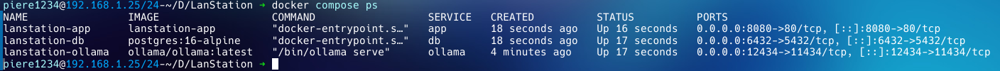

## Consulter les logs

Pour voir les logs en temps réel :

```bash
docker compose logs -f
```

Pour voir les logs d'un service en particulier :

```bash
docker compose logs -f app
docker compose logs -f db
docker compose logs -f ollama
```

## Accéder à l'application

Une fois les services démarrés, l'application est accessible à :

```
http://localhost:80
```

PostgreSQL écoute sur `localhost:6432` (depuis notre machine) et Ollama sur `localhost:12434`.

## Arrêter les services

Pour arrêter sans supprimer les conteneurs :

```bash
docker compose stop
```

Pour arrêter et supprimer les conteneurs (mais garder les données) :

```bash
docker compose down
```

Pour redémarrer :

```bash
docker compose start
```

## Autres

Attention dans l'`.env` : docker ne lit pas `localhost`. Pour référencer `localhost:5432` comme vous le feriez dans le `DATABASE_URL`, mettez plutôt `db:6432`. C'est dû à l'**isolation** dont nous avons parlé plus haut.

Nous rencontrons un autre problème :

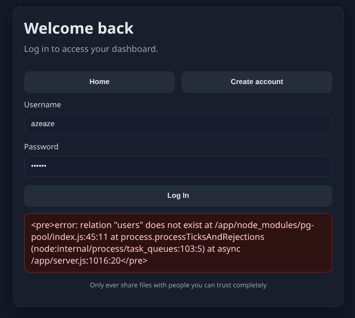

Il suffit de se connecter directement à psql. En effet, on peut lancer des commandes dans chaque service. Par exemple :

```bash
docker exec -it lanstation-db psql -U postgres
```
Lance un shell psql. Il suffit d'ici de coller le schéma de base de données contenu dans `db-schema.sql`.


 Mais de manière générale,
```bash
docker exec -it <name-of-docker-service> bash
```
Lance un shell isolé dans le service demandé. D'ailleurs, `-it` veut dire `-i` (isolated) et `-t` (tty), c'est-à-dire littéralement "shell isolé".

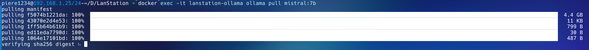

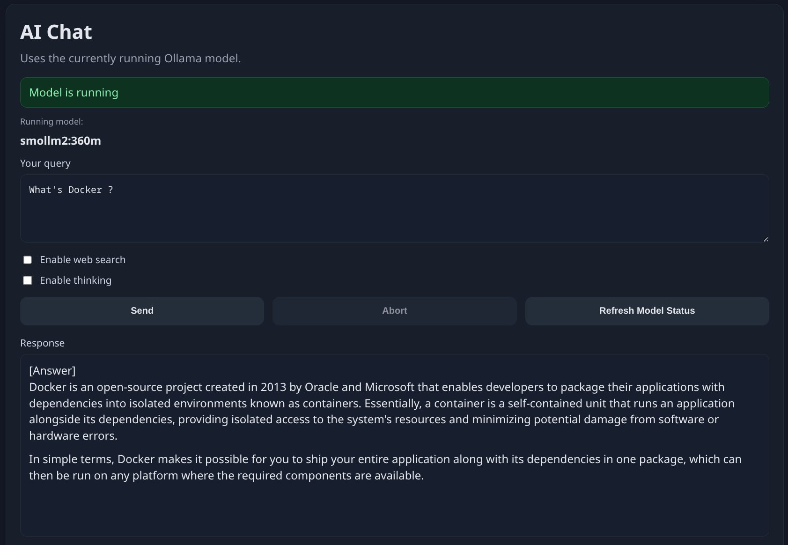

Vous pouvez aussi le faire depuis Docker Desktop.

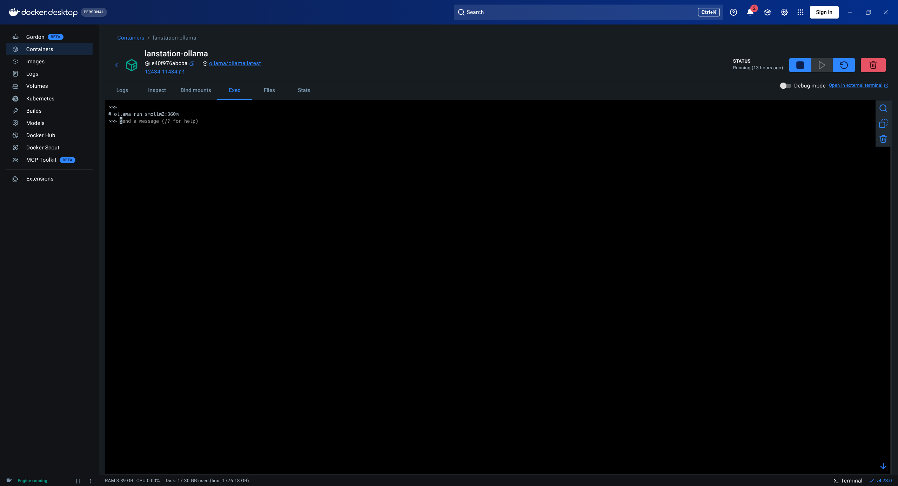