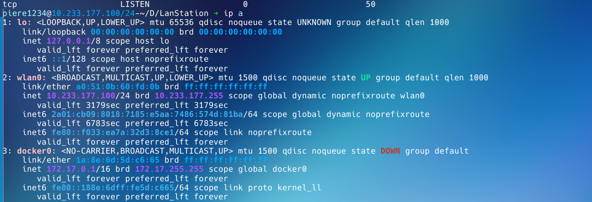
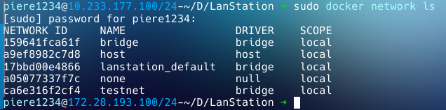
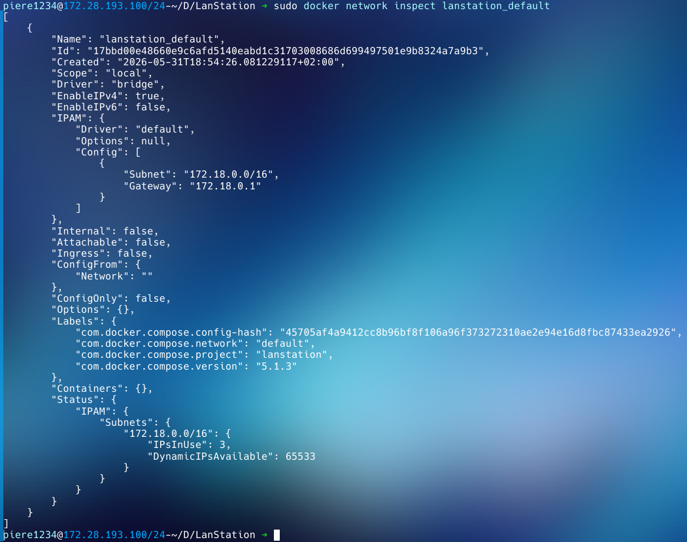
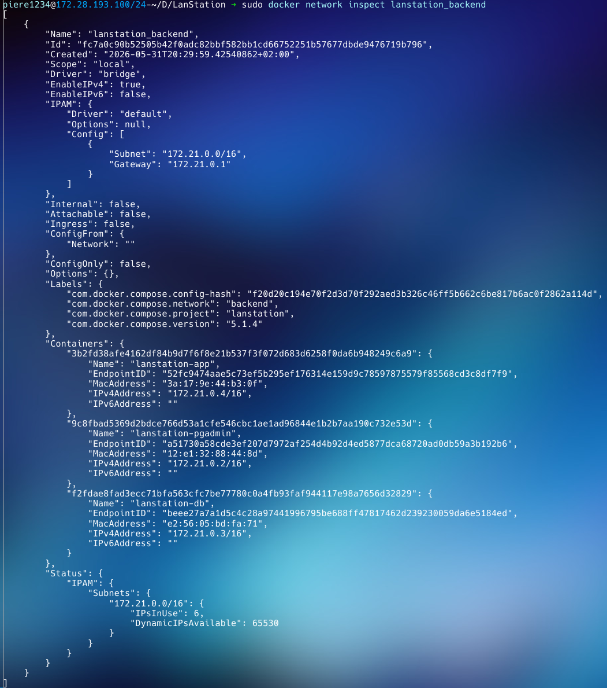
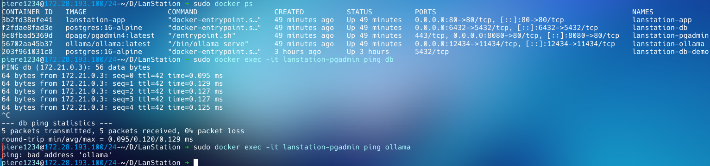
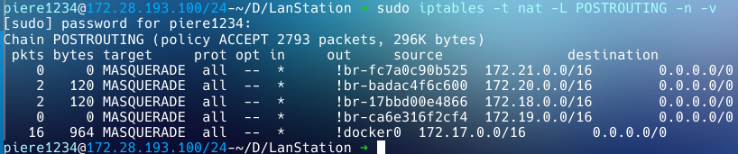
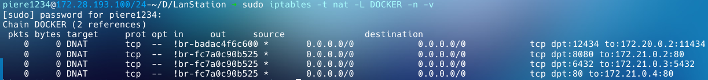
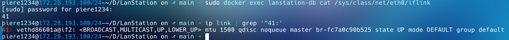
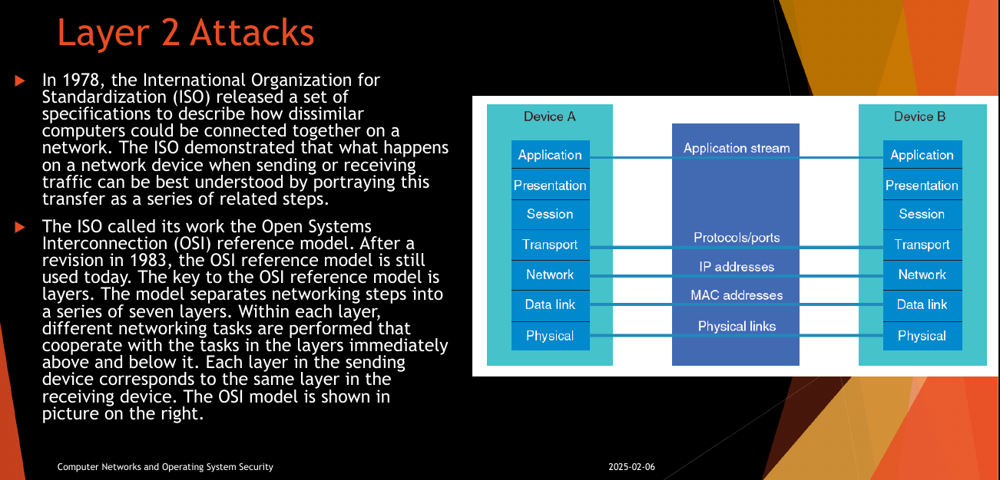

# Guide réseau Docker

Ce document complète le [guide principal](GUIDE.md) en se concentrant sur la couche *réseau* de Docker : comment elle fonctionne, les concepts (bridge, NAT, docker0, userland proxy, overlay, macvlan...), les différences Linux / Windows (parce qu'il y en a une au niveau du réseau), et surtout des exemples pratiques. En particulier comment lier les conteneurs dockers ensemble.

**En gros :**
- Concepts réseau Docker
- Comportement sur Linux vs Windows (WSL2 / VM)
- Mettre en réseau des conteneurs (pratique : bridge, user-defined networks)
- NAT, docker0 et iptables

## 1. Concepts réseau

Par défaut, Docker crée un réseau de type **bridge** (`bridge`) pour les conteneurs. En règle générale, quand on parle de bridge, le *guest* (machine invitée) est en connexion bridge avec l'**hôte**, c'est-à-dire que traditionnellement, tout le monde (d'un côté et de l'autre du pont) est sur le même sous réseau.

**NAT** (Network Address Translation) est un protocole qui permet de partager la connexion avec une machine invitée : toutefois, cette machine - bien qu'elle ait accès à Internet - ne peut pas communiquer avec l'hôte en local, les machines ne sont pas sur le même sous-réseau. Par exemple, sur une VM souvent, mon PC est en 192.168.1.0/24 alors que la VM est en 10.0.0.0/24. 

En revanche : dès lors que j'ai plusieurs machines sur le même sous-réseau derrière la NAT, j'ai créé ce qu'on appelle un NAT Network : toutes les machines de ce réseau communiquent entre elles, mais pas avec l'hôte. C'est en fait ceci que fait docker quand il crée un bridge : il crée un réseau bridge, mais *derrière* une **NAT**. Sur VirtualBox par exemple, on appelle ça plutôt un NAT Network.
A l'inverse, l'option `--network host` permet de lier notre réseau Docker à notre réseau local hôte ; c'est un peu moins sécurisé.

Selon l'installation, on voit une **NIC** (Network Interface Card), ou carte réseau virtuelle dès lors que l'on tape `ip a` (Linux) ou ipconfig (Windows) ou équivalent.



## 2. Différences Linux vs Windows (et WSL2)

Comme décrit dans le guide précédent, il existe une différence fondamentale entre installation Docker Windows et Linux, à savoir l'utilisation de WSL2 - et donc d'une VM, pour Windows. Dans notre cas cependant, et c'est un point que j'ai manqué dans le guide précédent, **Docker Desktop** utilise une VM peu importe le système d'exploitation hôte. 

Sur Linux, il utilise une VM lightweight afin d'assurer des fonctionnalités supplémentaires et une parité de ces fonctionnalités vis-à-vis de Windows/MacOS. Pour ce qui est de Docker (CLI) en revanche, Linux est le seul qui permette d'utiliser `--network host` de manière à ce que Docker rejoigne le réseau local : cette commande, lorsque utilisée par Docker Desktop ou un autre système d'exploitation, a une traduction quelque peu obscure et se connecte en fait à ladite VM. Additionnellement, Linux peut utiliser Macvlan et Ipvlan, c'est-à-dire asseigner des adresses MAC/IP à nos conteneurs, qui apparaissent comme des appareils physiques. Sur Windows/Mac/Docker Desktop la couche réseau ets pour ainsi dire **virtualisée**.

## 3. Quel réseau utiliser (use cases)

Docker propose plusieurs drivers réseau.

| Driver | Quand l'utiliser |
|---|---|
| `bridge` (défaut) | Conteneurs isolés sur un même hôte qui doivent communiquer |
| `host` | Performance maximale, pas besoin d'isolation réseau (Linux uniquement) |
| `none` | Conteneur totalement isolé, zéro accès réseau |
| `overlay` | Multi-hôtes (Swarm), conteneurs sur plusieurs machines |
| `macvlan` | Le conteneur doit apparaître comme un appareil physique sur le LAN |
| `ipvlan` | Similaire à macvlan, sans changer l'adresse MAC (utile sur réseaux stricts) |

### Bridge (défaut)

C'est le cas le plus courant pour du développement local. Tous les conteneurs lancés sans `--network` atterrissent sur le bridge par défaut (`docker0`), mais **sans résolution DNS** entre eux - on ne peut pas faire `ping mon-conteneur` par son nom.

La bonne pratique est de créer un **bridge personnalisé** (user-defined network) : Docker y active automatiquement un serveur DNS interne, ce qui permet aux conteneurs de se trouver par leur nom.

```bash
docker network create mon-reseau
docker run --network mon-reseau --name backend mon-image
docker run --network mon-reseau --name frontend autre-image
# frontend peut maintenant faire curl http://backend:8080
```

### Host

Le conteneur partage directement la pile réseau de l'hôte : même IP, mêmes ports, sans NAT. Utile pour des outils de monitoring ou des serveurs très sensibles à la latence.

```bash
docker run --network host nginx
# nginx écoute directement sur le port 80 de l'hôte
```

### None

Aucune interface réseau, hormis loopback. Pour des traitements de données sensibles ou des conteneurs qui n'ont besoin d'aucune connectivité.

```bash
docker run --network none alpine ping 8.8.8.8
# PING échoue : pas d'interface réseau disponible
```

### Overlay

Réservé aux environnements **multi-hôtes** avec Docker Swarm. Permet à des conteneurs sur des machines différentes de communiquer comme s'ils étaient sur le même réseau local, via encapsulation VxLAN.

> Hors périmètre pour un setup mono-machine - voir la section dédiée plus bas.

### Macvlan / IPvlan

Le conteneur obtient sa propre adresse MAC (macvlan) ou IP (ipvlan) et apparaît comme un appareil physique sur le réseau local. Utile pour intégrer des conteneurs dans un réseau d'entreprise existant, ou pour des besoins IoT.

```bash
docker network create -d macvlan \
  --subnet=192.168.1.0/24 \
  --gateway=192.168.1.1 \
  -o parent=eth0 \
  reseau-physique
```

Requiert Linux avec accès direct à l'interface physique. Non disponible sur Docker Desktop.

## 4. Mettre des conteneurs en réseau - exemple pratique

Reprenons notre projet.

### Ce que Docker Compose fait automatiquement

Sans aucune configuration réseau explicite, Docker Compose crée un **bridge personnalisé** pour le projet, nommé d'après le répertoire courant. Par exemple, si le projet est dans `lanstation/`, le réseau s'appellera `lanstation_default`.

Tous les services y sont connectés automatiquement et peuvent se joindre **par leur nom de service** :

- `app` peut contacter `db` via `db:5432`
- `app` peut contacter `ollama` via `ollama:11434`
- `pgadmin` peut contacter `db` via `db:5432`

Le nom utilisé est celui du service dans le `compose.yml`, pas le `container_name`. Le `container_name` est uniquement utile pour les commandes `docker` en dehors de Compose.

### Ports exposés vs ports internes

```yaml
ports:
  - "6432:5432"
```

Cette ligne publie le port `5432` du conteneur sur le port `6432` de l'hôte. Cela signifie :

- Depuis **l'hôte** (ou l'extérieur) : `localhost:6432`
- Depuis un **autre conteneur sur le même réseau** : `db:5432` - le port interne, pas le port publié

Même logique pour `ollama` :

- Depuis l'hôte : `localhost:12434`
- Depuis `app` : `ollama:11434`

### Ce que voit réellement chaque conteneur

```
lanstation_default (bridge user-defined)
├── app        → accessible via app:80
├── db         → accessible via db:5432
├── ollama     → accessible via ollama:11434
└── pgadmin    → accessible via pgadmin:80
```

Chaque conteneur a une IP privée attribuée par Docker sur ce réseau (typiquement en `172.18.0.0/16` ou similaire). Le DNS interne de Docker résout les noms de service vers ces IPs.

### Inspecter le réseau généré

```bash
docker network ls
```

```bash
docker network inspect lanstation_default
```


La commande `inspect` retourne les conteneurs connectés, leurs IPs, le subnet, la gateway, et les options du driver. C'est le premier réflexe à avoir pour diagnostiquer un problème de connectivité.

### Séparer les réseaux par responsabilité

Le compose actuel met tous les services sur le même réseau, ce qui fonctionne mais n'est pas idéal : `pgadmin` n'a pas besoin de voir `ollama`, et `ollama` n'a pas besoin de voir `db` directement.

Une version segmentée :

```yaml
services:
  app:
    build: .
    container_name: lanstation-app
    env_file:
      - .env
    ports:
      - "80:80"
    depends_on:
      - db
      - ollama
    networks:
      - frontend
      - backend
    restart: unless-stopped

  db:
    image: postgres:16-alpine
    container_name: lanstation-db
    env_file:
      - .env
    ports:
      - "6432:5432"
    volumes:
      - postgres_data:/var/lib/postgresql/data
      - ./db-schema.sql:/docker-entrypoint-initdb.d/01-db-schema.sql
    networks:
      - backend
    restart: unless-stopped

  ollama:
    image: ollama/ollama:latest
    container_name: lanstation-ollama
    ports:
      - "12434:11434"
    volumes:
      - ollama_data:/root/.ollama
    networks:
      - frontend
    restart: unless-stopped

  pgadmin:
    image: dpage/pgadmin4:latest
    container_name: lanstation-pgadmin
    env_file:
      - .env
    ports:
      - "8080:80"
    networks:
      - backend
    restart: unless-stopped

networks:
  frontend:
  backend:

volumes:
  postgres_data:
  ollama_data:
```

Avec cette configuration :



- `app` a un pied dans chaque réseau et peut parler à tous les services
- `db` et `pgadmin` sont isolés sur `backend` : `ollama` ne peut pas atteindre `db`



Ce type de segmentation suit le principe du moindre privilège : chaque service n'a accès qu'aux services dont il a besoin. C'est un principe fondamental en réseaux et en cybersécurité.

## 5. NAT, docker0 et iptables

### Le bridge docker0

Au démarrage du daemon Docker, une interface réseau virtuelle `docker0` est créée sur l'hôte. C'est un bridge Linux standard, visible avec `ip a` :


`docker0` est la gateway du réseau bridge par défaut. Chaque conteneur lancé sans réseau explicite obtient une IP dans ce sous-réseau (`172.17.0.0/16`) et voit `172.17.0.1` comme passerelle.

Les bridges personnalisés (créés par Compose ou manuellement) génèrent leurs propres interfaces, typiquement nommées `br-<id>` :

```bash
ip a | grep br-
```

### Paires veth

Quand un conteneur démarre et rejoint un réseau, Docker crée une **paire veth** (virtual ethernet) : deux interfaces virtuelles liées l'une à l'autre comme les deux extrémités d'un câble. Une extrémité est placée dans le namespace réseau du conteneur (`eth0` vu depuis l'intérieur), l'autre est attachée au bridge sur l'hôte.

```bash
# Sur l'hôte, lister les interfaces veth
ip link show type veth

# Dans le conteneur
docker exec lanstation-db ip a
# 1: lo: ...
# 14: eth0@if15: inet 172.18.0.3/16 ...
```

L'index `if15` indique que l'interface paire côté hôte porte l'index 15. On peut croiser cette information avec `ip link` sur l'hôte pour identifier quelle veth correspond à quel conteneur.

### NAT et la règle MASQUERADE

Docker ne se contente pas de créer un bridge : il configure **iptables** pour que les conteneurs puissent atteindre l'extérieur. La règle clé est dans la chaîne `POSTROUTING` de la table `nat` :

```bash
sudo iptables -t nat -L POSTROUTING -n -v
```


`MASQUERADE` est une forme dynamique de SNAT (Source NAT). Quand un conteneur envoie un paquet vers l'extérieur, l'hôte remplace l'IP source (privée, ex. `172.18.0.3`) par sa propre IP publique. La réponse revient à l'hôte, qui la retransmet au conteneur. Les conteneurs sont invisibles depuis l'extérieur.

### Publication de ports et DNAT

Quand on publie un port (`-p 6432:5432`), Docker ajoute une règle de **DNAT** (Destination NAT) :

```bash
sudo iptables -t nat -L DOCKER -n -v
```


Un paquet entrant sur le port `6432` de l'hôte est redirigé vers `172.18.0.3:5432` (l'IP interne du conteneur `db`). C'est Docker qui gère ces règles automatiquement à chaque `docker run` ou `docker compose up`.

### Chaînes iptables créées par Docker

Docker injecte plusieurs chaînes dans iptables :

```
DOCKER          - règles DNAT pour la publication de ports
DOCKER-USER     - chaîne vide, réservée à l'utilisateur pour des règles custom
DOCKER-ISOLATION-STAGE-1  - isolation inter-réseaux (étape 1)
DOCKER-ISOLATION-STAGE-2  - isolation inter-réseaux (étape 2)
```

La chaîne `DOCKER-USER` est particulièrement utile : les règles qu'on y place sont évaluées avant celles de Docker et ne sont pas écrasées au redémarrage du daemon.

```bash
# Bloquer l'accès au port 6432 depuis toutes les IPs sauf une
sudo iptables -I DOCKER-USER -p tcp --dport 6432 ! -s 192.168.1.50 -j DROP
```

### Le userland proxy

Par défaut, Docker lance aussi un processus `docker-proxy` sur l'hôte pour chaque port publié :

```bash
ps aux | grep docker-proxy
# /usr/bin/docker-proxy -proto tcp -host-ip 0.0.0.0 -host-port 6432 \
#   -container-ip 172.18.0.3 -container-port 5432
```

Ce proxy gère le cas particulier du loopback : quand une connexion vient de `127.0.0.1` sur l'hôte, les règles iptables/DNAT ne s'appliquent pas correctement sans lui. Il peut être désactivé dans `/etc/docker/daemon.json` :

```json
{
  "userland-proxy": false
}
```

Avec cette option, seules les règles iptables gèrent la redirection. Gain de ressources, mais perte de la gestion loopback dans certains cas.

### Schéma complet du flux réseau

```
Internet / LAN
      |
   [eth0 - hôte : 192.168.1.10]
      |
   iptables (DNAT :6432 → 172.18.0.3:5432)
      |
   [br-xxxx - bridge lanstation_backend : 172.18.0.1]
      |
   [veth] ←→ [eth0 conteneur db : 172.18.0.3]
```

Un paquet entrant sur `192.168.1.10:6432` traverse iptables, est redirigé par DNAT vers l'IP interne du conteneur, traverse le bridge via la paire veth, et arrive dans le namespace réseau de `db` sur le port `5432`.

## 6. Diagnostic et dépannage réseau

### L'image netshoot

La plupart des images de production (Alpine, Distroless) n'embarquent pas les outils réseau. L'image `nicolaka/netshoot` regroupe `ping`, `dig`, `nslookup`, `curl`, `tcpdump`, `ss`, `traceroute`, `iperf3` et une trentaine d'autres outils.

Lancer un conteneur de diagnostic sur le même réseau que le projet :

```bash
docker run --rm -it \
  --network lanstation_default \
  nicolaka/netshoot
```

Depuis ce conteneur, tous les services du projet sont accessibles par leur nom :

```bash
curl http://app:80
dig db
tcpdump -i eth0 port 5432
```

Pour diagnostiquer un problème sur un réseau spécifique (frontend ou backend dans la version segmentée) :

```bash
docker run --rm -it \
  --network lanstation_backend \
  nicolaka/netshoot
```

### Entrer dans le namespace réseau d'un conteneur

Sans modifier le conteneur, on peut utiliser `nsenter` depuis l'hôte pour entrer dans son namespace réseau et lancer des commandes comme si on était à l'intérieur :

```bash
# Récupérer le PID du conteneur
PID=$(docker inspect lanstation-db --format '{{.State.Pid}}')

# Entrer dans son namespace réseau
sudo nsenter -t $PID -n ip a
sudo nsenter -t $PID -n ss -tlnp
sudo nsenter -t $PID -n tcpdump -i eth0
```

Utile quand le conteneur ne dispose d'aucun shell ou outil de diagnostic.

### Identifier quelle veth correspond à quel conteneur

Comme vu sur le `ip a` précédent, les interfaces `veth` sur l'hôte ne sont pas nommées de manière lisible. Pour faire le lien :

```bash
docker exec lanstation-db cat /sys/class/net/eth0/iflink

ip link | grep '^xx:'

```



L'index retourné par `iflink` dans le conteneur correspond à l'index de la veth côté hôte.

### Problèmes fréquents

**Un conteneur ne trouve pas un autre par son nom**

Vérifier qu'ils sont sur le même réseau user-defined, pas sur `docker0` :

```bash
docker inspect lanstation-app --format '{{json .NetworkSettings.Networks}}' | jq 'keys'
docker inspect lanstation-db --format '{{json .NetworkSettings.Networks}}' | jq 'keys'
```

Si l'un des deux est sur `bridge` (le réseau par défaut) et l'autre sur `lanstation_default`, ils ne se voient pas (évidemment).

**Un port publié n'est pas accessible depuis l'hôte**

```bash
# Vérifier que le conteneur écoute bien sur le bon port
docker exec lanstation-db ss -tlnp

# Vérifier la règle DNAT générée
sudo iptables -t nat -L DOCKER -n -v | grep 5432
```

**Conflits de sous-réseaux**

Docker alloue les sous-réseaux automatiquement dans la plage `172.16.0.0/12`. Si cette plage chevauche un réseau existant sur l'hôte (VPN, interface physique), des problèmes de routage apparaissent. On peut forcer le subnet à la création :

```bash
docker network create \
  --subnet=10.100.0.0/24 \
  --gateway=10.100.0.1 \
  mon-reseau
```

Ou dans `compose.yml` :

```yaml
networks:
  backend:
    ipam:
      config:
        - subnet: 10.100.0.0/24
          gateway: 10.100.0.1
```

## 7. Overlay et multi-hôtes

### Prérequis

Le driver overlay repose sur Docker Swarm. Il nécessite que les hôtes participants aient les ports suivants ouverts entre eux :

| Port | Protocole | Usage |
|------|-----------|-------|
| 2377 | TCP | Communication du cluster Swarm |
| 7946 | TCP + UDP | Découverte des noeuds |
| 4789 | UDP | Trafic VxLAN (données des conteneurs) |

### Initialiser un Swarm

Sur le noeud manager :

```bash
docker swarm init --advertise-addr 192.168.1.10
# Swarm initialized: current node (abc123) is now a manager.
# To add a worker to this swarm, run the following command:
#     docker swarm join --token SWMTKN-1-xxx 192.168.1.10:2377
```

Sur les noeuds workers :

```bash
docker swarm join --token SWMTKN-1-xxx 192.168.1.10:2377
```

### Créer un réseau overlay

```bash
docker network create \
  --driver overlay \
  --subnet 10.200.0.0/24 \
  mon-overlay
```

Ce réseau est automatiquement disponible sur tous les noeuds du Swarm. Un conteneur démarré sur le noeud A peut joindre un conteneur sur le noeud B par son nom de service, exactement comme sur un bridge local.

### VxLAN - ce qui se passe sous le capot

Le trafic entre conteneurs sur des hôtes différents est encapsulé dans des paquets UDP sur le port 4789. Un paquet émis par un conteneur sur l'hôte A vers un conteneur sur l'hôte B est encapsulé ainsi :

```
[ En-tête Ethernet hôte ]
[ IP hôte A → IP hôte B ]
[ UDP port 4789         ]
[ En-tête VxLAN         ]
[ Paquet original du conteneur ]
```

L'hôte B décapsule le paquet et le transmet au conteneur destinataire via son interface veth locale. Les deux conteneurs ne voient qu'un réseau plat - l'encapsulation est transparente.

### Chiffrement du trafic overlay

Par défaut, le trafic VxLAN n'est pas chiffré. Pour activer le chiffrement IPsec :

```bash
docker network create \
  --driver overlay \
  --opt encrypted \
  --subnet 10.200.0.0/24 \
  mon-overlay-chiffre
```

Chaque paquet VxLAN est alors chiffré avec AES-GCM. Impact sur les performances mesurable à haut débit, négligeable pour la plupart des usages.

### Services Swarm et load balancing

En Swarm, on ne lance pas des conteneurs mais des **services**. Un service peut avoir plusieurs répliques, réparties sur les noeuds disponibles :

```bash
docker service create \
  --name backend \
  --network mon-overlay \
  --replicas 3 \
  mon-image
```

Docker Swarm expose le service via une **VIP** (Virtual IP) : une IP unique attribuée au service, quel que soit le nombre de répliques. Le trafic entrant sur cette VIP est distribué entre les répliques via `ipvs` (IP Virtual Server), un load balancer intégré au noyau Linux.

```bash
# Inspecter la VIP d'un service
docker service inspect backend --format '{{json .Endpoint.VirtualIPs}}'
```

L'alternative est le mode `dnsrr` (DNS round-robin) : pas de VIP, le DNS retourne directement les IPs de toutes les répliques à tour de rôle. Moins fiable (dépend du TTL DNS côté client) mais utile quand le client doit connaître les IPs individuelles.

```bash
docker service create \
  --name backend \
  --network mon-overlay \
  --endpoint-mode dnsrr \
  --replicas 3 \
  mon-image
```

### Réseau ingress

Swarm crée automatiquement un réseau overlay spécial nommé `ingress`, utilisé pour le **routing mesh** : quand un port est publié sur un service, n'importe quel noeud du Swarm peut recevoir le trafic sur ce port et le rediriger vers une réplique, même si cette réplique ne tourne pas sur ce noeud.

```
Client → noeud A:80 → (routing mesh) → réplique sur noeud B:80
```

```bash
docker network inspect ingress
```

### Limitations overlay sans Swarm

Il est techniquement possible de créer un réseau overlay en mode `attachable` pour des conteneurs standalone (sans services Swarm) :

```bash
docker network create \
  --driver overlay \
  --attachable \
  mon-overlay-standalone
```

Mais cette configuration reste marginale : la découverte de noeuds et la propagation du réseau dépendent du Swarm. Sans Swarm actif, l'overlay ne fonctionne pas.

### Overlay vs bridge - quand choisir

Un bridge user-defined couvre la grande majorité des cas sur un seul hôte. L'overlay devient nécessaire uniquement quand :

- les conteneurs sont répartis sur plusieurs machines physiques ou VMs
- on fait de la haute disponibilité avec réplication de services
- on utilise Docker Swarm comme orchestrateur

Pour du Kubernetes, le driver overlay Docker n'est pas utilisé - Kubernetes a son propre modèle réseau (CNI) avec des plugins dédiés comme Calico, Flannel ou Cilium.

## 8. Macvlan et IPvlan

### Le problème que ces drivers résolvent

Avec bridge et overlay, les conteneurs ont des IPs privées non routables sur le réseau local. Pour qu'un équipement extérieur (un autre serveur, un NAS, un appareil IoT) puisse joindre un conteneur directement par son IP, sans passer par une publication de port sur l'hôte, il faut que le conteneur apparaisse comme un appareil à part entière sur le réseau physique. C'est ce que font macvlan et ipvlan.

### Macvlan

Macvlan assigne une adresse MAC unique à chaque conteneur. Du point de vue du switch physique, le conteneur est un appareil indépendant.

```bash
docker network create -d macvlan \
  --subnet=192.168.1.0/24 \
  --gateway=192.168.1.1 \
  --ip-range=192.168.1.128/25 \
  -o parent=eth0 \
  reseau-physique
```

- `--subnet` et `--gateway` doivent correspondre au réseau physique existant
- `--ip-range` restreint la plage dans laquelle Docker alloue les IPs, pour éviter les conflits avec le DHCP
- `-o parent` désigne l'interface physique de l'hôte à utiliser

Lancer un conteneur sur ce réseau :

```bash
docker run --rm -it \
  --network reseau-physique \
  --ip 192.168.1.150 \
  alpine sh

# Depuis le conteneur
ip a
# eth0: inet 192.168.1.150/24
ping 192.168.1.1   # gateway physique : OK
```

Ce conteneur est maintenant joignable depuis n'importe quel appareil du réseau local sur `192.168.1.150`, sans aucune règle iptables ni publication de port.

**Limitation importante** : par défaut, le conteneur macvlan ne peut pas communiquer avec l'hôte qui l'héberge. C'est une contrainte du noyau Linux - une interface macvlan ne peut pas envoyer de trafic à son interface parent. Pour contourner cela, on crée une interface macvlan sur l'hôte lui-même :

```bash
sudo ip link add macvlan-host link eth0 type macvlan mode bridge
sudo ip addr add 192.168.1.151/24 dev macvlan-host
sudo ip link set macvlan-host up
```

L'hôte communique alors avec les conteneurs macvlan via cette interface dédiée.

**Promiscuous mode** : macvlan requiert que l'interface physique soit en mode promiscuité pour recevoir des trames destinées à des MACs autres que la sienne. Sur du matériel physique ce n'est pas un problème, mais certains hyperviseurs (VMware, VirtualBox) bloquent ce mode par défaut. Il faut l'activer explicitement dans les paramètres de la VM.

### Macvlan 802.1q (trunk)

Pour utiliser macvlan sur un réseau avec VLANs, Docker peut créer une sous-interface taggée :

```bash
docker network create -d macvlan \
  --subnet=192.168.10.0/24 \
  --gateway=192.168.10.1 \
  -o parent=eth0.10 \
  vlan10

docker network create -d macvlan \
  --subnet=192.168.20.0/24 \
  --gateway=192.168.20.1 \
  -o parent=eth0.20 \
  vlan20
```

Si `eth0.10` n'existe pas, Docker la crée automatiquement comme sous-interface 802.1q. Les conteneurs sur `vlan10` et `vlan20` sont isolés l'un de l'autre comme sur deux VLANs physiques distincts.

### IPvlan

IPvlan fonctionne différemment : tous les conteneurs partagent la même adresse MAC que l'interface parent, mais ont chacun leur propre IP. Cela contourne le problème du promiscuous mode et fonctionne sur les hyperviseurs et équipements réseau qui filtrent les MACs multiples.

Il existe deux modes :

**Mode L2** - comportement similaire à macvlan, les conteneurs sont sur le même segment réseau que l'hôte :

```bash
docker network create -d ipvlan \
  --subnet=192.168.1.0/24 \
  --gateway=192.168.1.1 \
  -o parent=eth0 \
  -o ipvlan_mode=l2 \
  reseau-ipvlan-l2
```

**Mode L3** - Docker agit comme un routeur. Les conteneurs sont sur un sous-réseau distinct, et l'hôte route le trafic entre eux et le réseau physique. Pas de broadcast, pas de ARP entre conteneurs - plus scalable pour un grand nombre de conteneurs :

```bash
docker network create -d ipvlan \
  --subnet=10.50.0.0/24 \
  -o parent=eth0 \
  -o ipvlan_mode=l3 \
  reseau-ipvlan-l3
```

En mode L3, il n'y a pas de gateway à spécifier : c'est l'hôte lui-même qui joue ce rôle. Le réseau physique doit avoir une route statique vers `10.50.0.0/24` via l'IP de l'hôte pour que les autres équipements puissent joindre les conteneurs.

En passant, L2 et L3 veulent dire **Layer 2** et **Layer 3** et font référence aux layers 2 et 3 du modèle OSI. Il désignent les communications Data Link (MAC) et Network (IP) respectivement.



*extrait de mon cours de CNOSS à Vilnius Gediminas Technical University (VILNIUS TECH)*

### Comparaison macvlan / ipvlan

| | Macvlan | IPvlan L2 | IPvlan L3 |
|---|---|---|---|
| MAC par conteneur | Unique | Partagée (parent) | Partagée (parent) |
| Promiscuous mode requis | Oui | Non | Non |
| ARP entre conteneurs | Oui | Oui | Non |
| Routage inter-réseaux | Non | Non | Oui (hôte routeur) |
| Fonctionne sur hyperviseur | Selon config | Oui | Oui |
| Disponible sur Docker Desktop | Non | Non | Non |

### Cas d'usage

- **Macvlan bridge** : intégrer des conteneurs dans un réseau d'entreprise existant, remplacer des VMs qui doivent avoir une IP fixe sur le LAN
- **Macvlan 802.1q** : environnements multi-VLANs, segmentation réseau existante à respecter
- **IPvlan L2** : même besoin que macvlan mais sur hyperviseur ou switch qui bloque les MACs multiples
- **IPvlan L3** : grand nombre de conteneurs, environnements embarqués, réseaux sans broadcast

## 9. Sécurité réseau

### Isolation par défaut

Un réseau user-defined isole déjà les conteneurs des autres réseaux Docker. Un conteneur sur `lanstation_backend` ne peut pas joindre un conteneur sur un réseau d'un autre projet Compose, sauf configuration explicite. Cette isolation est assurée par les chaînes `DOCKER-ISOLATION-STAGE-1` et `DOCKER-ISOLATION-STAGE-2` dans iptables.

```bash
sudo iptables -L DOCKER-ISOLATION-STAGE-1 -n -v
```

### Bloquer la communication inter-conteneurs sur le bridge par défaut

Sur le bridge par défaut (`docker0`), tous les conteneurs peuvent se joindre librement. Pour désactiver ce comportement globalement :

```bash
# /etc/docker/daemon.json
{
  "icc": false
}
```

`icc` (Inter-Container Communication) à `false` ajoute une règle DROP sur le bridge par défaut. Les communications restent possibles uniquement via les ports explicitement publiés. Cette option n'affecte pas les réseaux user-defined, qui ont leur propre isolation.

### La chaîne DOCKER-USER

Toutes les règles iptables générées par Docker peuvent être contournées ou précédées par des règles placées dans `DOCKER-USER`. C'est la seule chaîne que Docker ne modifie jamais - les règles qu'on y place survivent aux redémarrages du daemon.

Exemples utiles :

```bash
# Bloquer l'accès au port 6432 (postgres) depuis tout le monde sauf une IP
sudo iptables -I DOCKER-USER \
  -p tcp --dport 6432 \
  ! -s 192.168.1.50 \
  -j DROP

# Bloquer tout accès externe aux ports Docker (garder uniquement le LAN)
sudo iptables -I DOCKER-USER \
  -i eth0 \
  ! -s 192.168.1.0/24 \
  -j DROP

# Lister les règles DOCKER-USER
sudo iptables -L DOCKER-USER -n -v --line-numbers

# Supprimer une règle par numéro
sudo iptables -D DOCKER-USER 1
```

Ces règles sont perdues au redémarrage de l'hôte. Pour les rendre persistantes :

```bash
# Debian/Ubuntu
sudo apt install iptables-persistent
sudo netfilter-persistent save

# Arch/CachyOS
sudo pacman -S iptables
sudo iptables-save > /etc/iptables/iptables.rules
sudo systemctl enable iptables
```

### Désactiver la gestion iptables par Docker

Si l'hôte a un pare-feu existant (nftables, firewalld) et qu'on veut en garder le contrôle total :

```bash
# /etc/docker/daemon.json
{
  "iptables": false
}
```

Avec cette option, Docker ne touche plus à iptables. Les publications de port (`-p`) ne créent plus de règles DNAT automatiquement - c'est à l'administrateur de les gérer manuellement. A n'utiliser que si on maîtrise le pare-feu de l'hôte.

### Conteneur sans réseau

Pour les traitements qui n'ont besoin d'aucune connectivité - compilation, chiffrement, traitement de fichiers sensibles :

```bash
docker run --rm \
  --network none \
  --volume $(pwd)/data:/data \
  mon-image \
  python traitement.py
```

Le conteneur n'a qu'une interface loopback. Aucun paquet ne peut entrer ou sortir. C'est la forme d'isolation réseau la plus stricte disponible sans configuration supplémentaire.

### Exposer uniquement sur localhost

Par défaut, un port publié est accessible sur toutes les interfaces de l'hôte (`0.0.0.0`). Pour restreindre à localhost uniquement :

```bash
docker run -p 127.0.0.1:5432:5432 postgres
```

Dans `compose.yml` :

```yaml
ports:
  - "127.0.0.1:6432:5432"
```

Utile pour `pgadmin` ou des interfaces d'administration qui ne doivent pas être accessibles depuis le réseau local, seulement depuis l'hôte lui-même via un tunnel SSH par exemple.

### Principe du moindre privilège appliqué au réseau

En reprenant le projet lanstation, une configuration orientée sécurité :

```yaml
services:
  app:
    networks:
      - frontend
      - backend

  db:
    ports:
      - "127.0.0.1:6432:5432"   # postgres accessible uniquement en local
    networks:
      - backend

  ollama:
    ports:
      - "127.0.0.1:12434:11434" # ollama accessible uniquement en local
    networks:
      - frontend

  pgadmin:
    ports:
      - "127.0.0.1:8080:80"     # pgadmin accessible uniquement en local
    networks:
      - backend

networks:
  frontend:
  backend:
```

Aucun service d'administration n'est exposé sur le réseau local. L'accès se fait par tunnel SSH (`ssh -L 8080:localhost:8080 user@serveur`) depuis une machine autorisée.

## 10. Schéma récapitulatif - projet lanstation

### Topologie flat (compose de départ)

Tous les services partagent un seul réseau `lanstation_default`. Simple, fonctionnel, mais sans isolation entre services.

```
Hôte : 192.168.1.10
│
├── eth0 (réseau physique LAN)
│
├── br-xxxx : lanstation_default (172.19.0.0/16)
│   ├── app        172.19.0.2   ← port 80  publié sur 0.0.0.0:80
│   ├── db         172.19.0.3   ← port 5432 publié sur 0.0.0.0:6432
│   ├── ollama     172.19.0.4   ← port 11434 publié sur 0.0.0.0:12434
│   └── pgadmin    172.19.0.5   ← port 80 publié sur 0.0.0.0:8080
│
└── docker0 : bridge par défaut (172.17.0.0/16) - inactif
```

Flux d'un appel depuis `app` vers `db` :

```
app:172.19.0.2 → db:5432 (DNS interne → 172.19.0.3) → bridge → veth → db
```

Flux d'une connexion externe vers postgres :

```
Client:XXXX → hôte:6432 → iptables DNAT → 172.19.0.3:5432 → veth → db
```

### Topologie segmentée (version sécurisée)

```
Hôte : 192.168.1.10
│
├── eth0 (réseau physique LAN)
│
├── br-xxxx : lanstation_frontend (172.20.0.0/16)
│   ├── app     172.20.0.2
│   └── ollama  172.20.0.3   ← port 11434 publié sur 127.0.0.1:12434
│
├── br-xxxx : lanstation_backend (172.21.0.0/16)
│   ├── app      172.21.0.2  (même conteneur, deux interfaces)
│   ├── db       172.21.0.3  ← port 5432 publié sur 127.0.0.1:6432
│   └── pgadmin  172.21.0.4  ← port 80 publié sur 127.0.0.1:8080
│
└── docker0 : bridge par défaut (172.17.0.0/16) - inactif
```

`app` a deux interfaces réseau : une sur chaque bridge. C'est le seul conteneur qui peut parler à la fois à `ollama` et à `db`. `pgadmin` voit `db` mais pas `ollama`. `ollama` ne voit pas `db`.

### Ce que Docker crée automatiquement pour ce projet

| Composant | Ce que Docker crée |
|---|---|
| Réseau Compose | 1 bridge `br-xxxx` par réseau déclaré |
| Par conteneur | 1 paire veth par réseau rejoint |
| DNS | Serveur `127.0.0.11` dans chaque conteneur |
| NAT sortant | Règle MASQUERADE par sous-réseau |
| Publication de port | Règle DNAT + processus `docker-proxy` |
| Isolation inter-réseaux | Chaînes `DOCKER-ISOLATION-STAGE-1/2` |